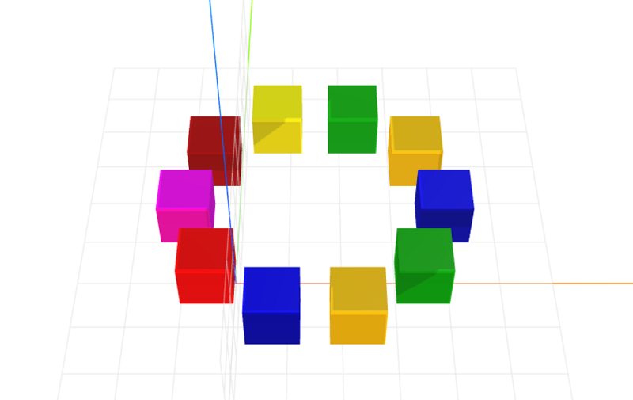

# circle-layout
Parameterized circle layout for CraftML

### Install
    $ npm install circle-layout

### Parameters
- radius: adjusts radius of item arrangement
- degrees: adjusts location of item arrangement

### Example
```html
<craft>
    <craft name="circle-layout" module="circle-layout"/>
    
    <circle-layout radius="25">
        <repeat n="10">
            <cube></cube>
        </repeat>
    </circle-layout> 
</craft>
```



